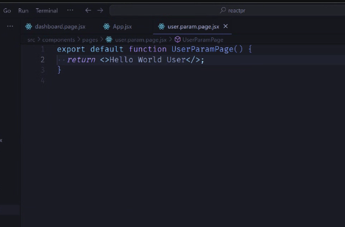
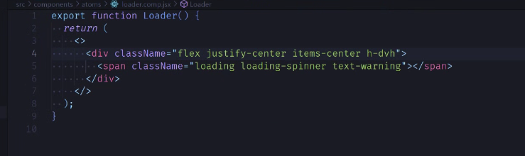

query params

2. version: route params, dyn
1. query

dynamisch.

loader suspense lazy:

code splitting

---

sso

markus:

add screenshots..

redirect comp in atoms, loader lädt..

useNavigate

dashboard:

wrapper zeigt es erst an nach signin:

---

### trennung darstellung inhalt / logik und darstellung

so geil:

---

"unseriös": war eigentlich Kompliment. Denn ALLE Deine Arguente waren erst nachvollziehbar, dann - nach Verstehen - RICHTIG. Wenn mich was daran sehr ärgert, dann ist das meine grottendämliche Naivität. Potentiell schon wieder fast zum Affen und nützlichen Idioten gemacht. Und schlimmer: andere gleich mit.

kleines I/O Problem: ich brauch kaffee..
Bild vom Output überlasse ich Euch, viel Spaß damit.

---

Gestern:
ging leicht daneben wohl.. na, gibt so Tage.
Wen schert´s? Zukunft ist vorne, heute neuer Tag. :rocket::github_on_fire::heart_eyes:
