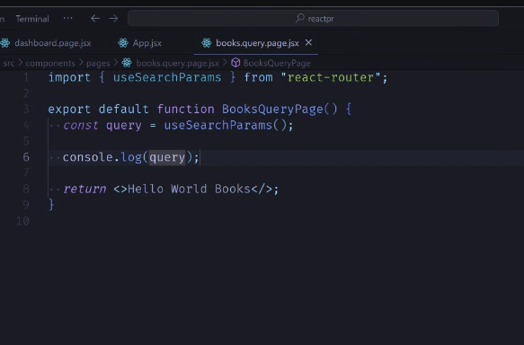

query params

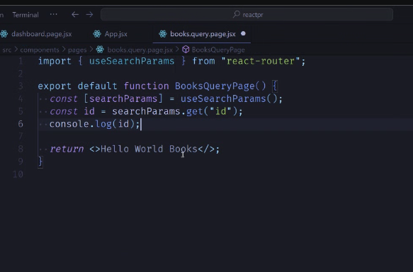

2. version: route params, dyn
1. query

dynamisch.

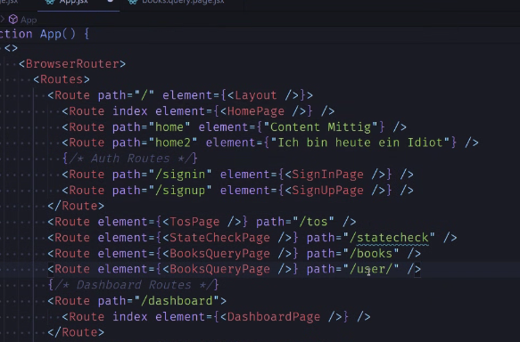

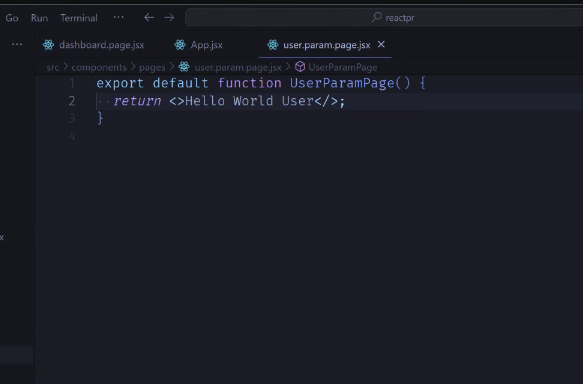
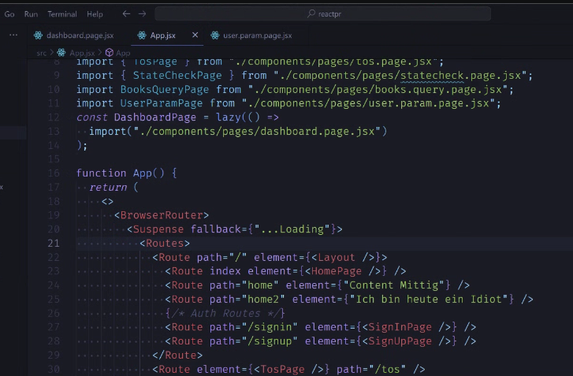

loader suspense lazy:

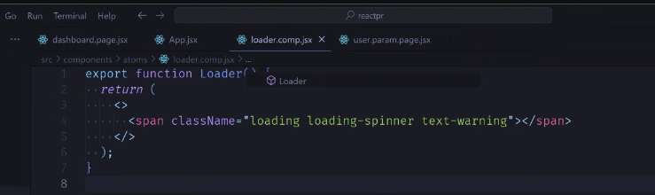
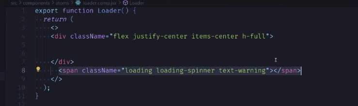
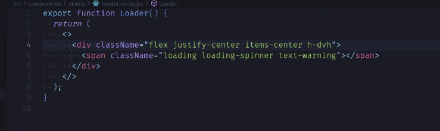
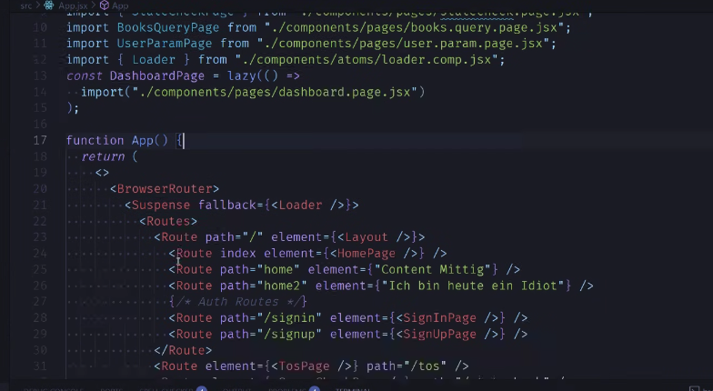

code splitting

---

sso

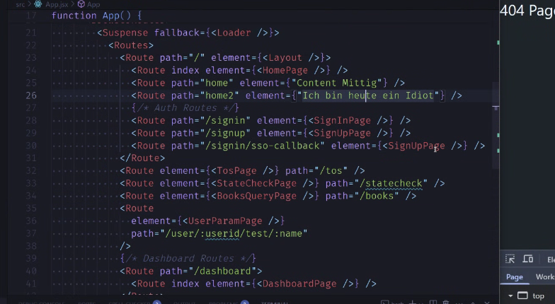
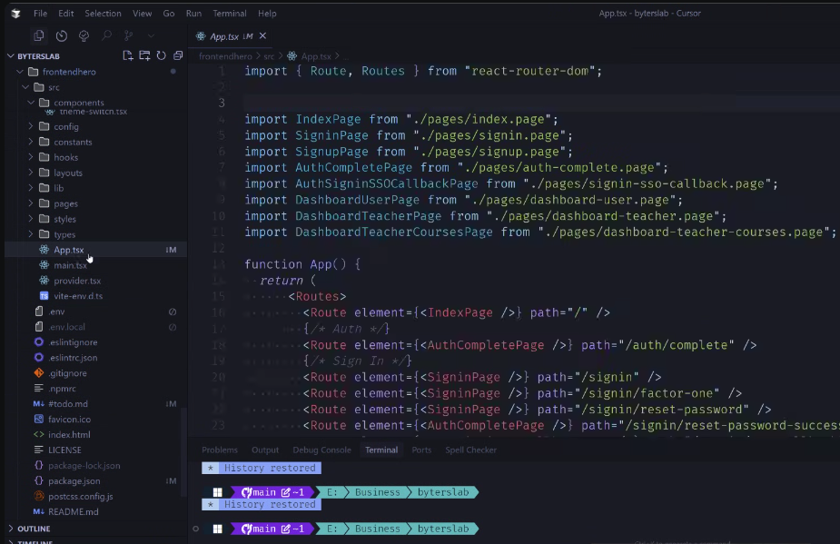

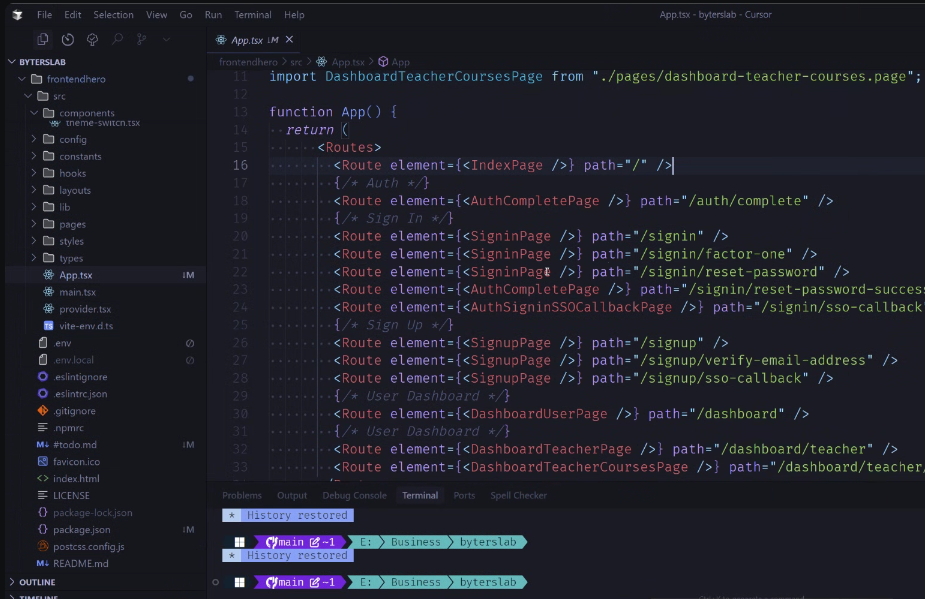
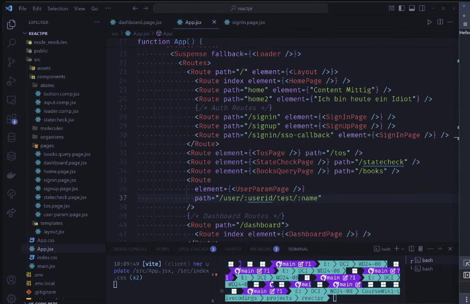

markus:

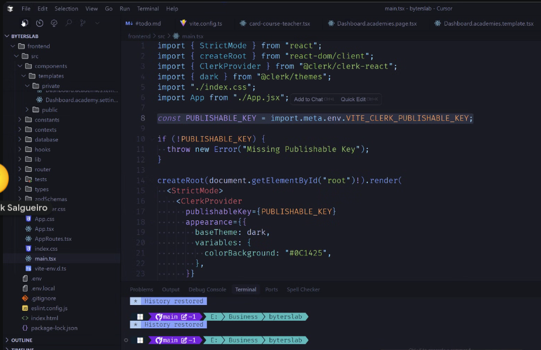

add screenshots..

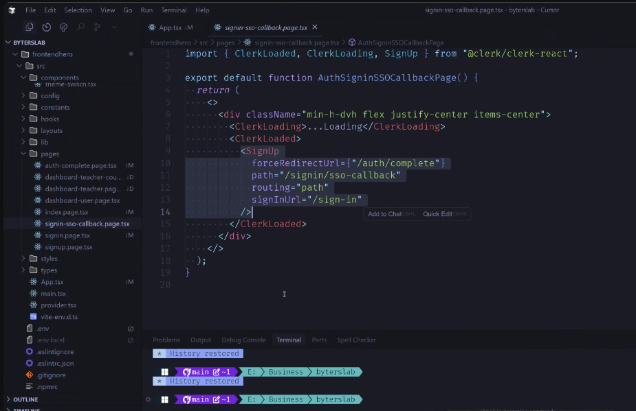
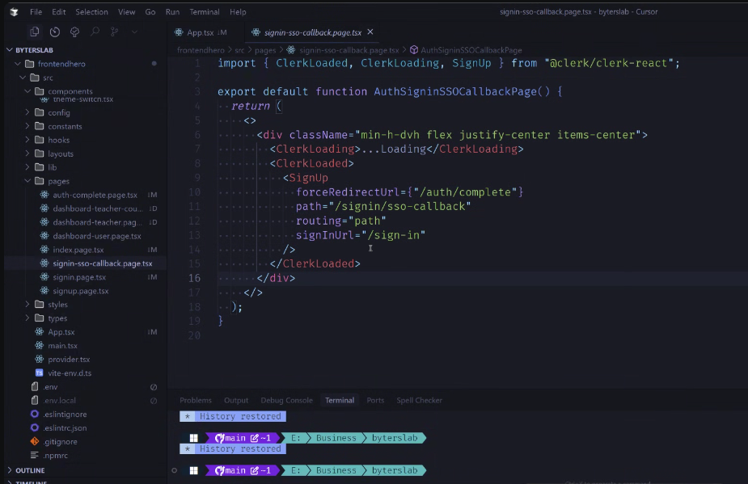

---

"unseriös": war eigentlich Kompliment. Denn ALLE Deine Arguente waren erst nachvollziehbar, dann - nach Verstehen - RICHTIG. Wenn mich was daran sehr ärgert, dann ist das meine grottendämliche Naivität. Potentiell schon wieder fast zum Affen und nützlichen Idioten gemacht. Und schlimmer: andere gleich mit.
